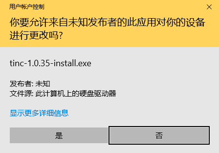
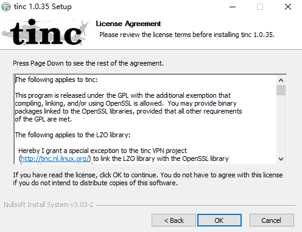

# 3. 笔记本 / Windows 10

　　本节将日常使用的笔记本连入 VPN，操作系统为 Windows 10 。虽然以 Win10 为例，但 Windows 系列操作基本一致，需要注意的是权限问题以及默认防火墙策略的设置。


VPN 设置：

| 项目         | 数据            |
| ------------ | --------------- |
| VPN 网络名称 | home_vpn        |
| VPN 主机名称 | notebook    |
| VPN IP       | 10.0.0.101      |
| VPN 子网掩码 | 255.255.255.0   |
| VPN CIDR     | 10.0.0.101/24   |
| tinc 端口    | 655(默认)       |


## 安装 tinc

　　首先到官网下载安装包　<https://www.tinc-vpn.org/download/>。目前能下载到的最新稳定版是 1.0.35。下载完成后运行安装程序，直接 Next，Next 到 Finish 即可，整个过程非常的简单。





　　安装完成后，需要先安装虚拟网卡设备。在任务栏 Win 按钮处，按鼠标右键并选择 **Windows PowerShell（管理员）(A)**，后面的操作我们都将使用打开的命令行窗口（方便获得管理员权限也方便读者粘帖命令）：


执行下面的命令增加一块虚拟网卡，安装过程中如果出现安全提示，如下图，请选择 *安装*：

```
& 'C:\Program Files (x86)\tinc\tap-win64\addtap.bat'
```


　　在任务栏 Win 按钮处，按鼠标右键并选择 **网络连接**，然后右侧选择 **网络和共享中心**，接着左侧选择 **更改适配器设置**，这时右侧就列出了当前系统中所有的网卡设备，如下图。可以看到系统新增加了一块网卡 *以太网 2*，请记住这个名称，后面配置文件中需要用到。目前，该设备的状态是个小红叉，处于“网络电缆被拔出”状态。

*备注：由于配置环境的差异，您的可能与我不同（例如 Win7 中为 *本地连接 2*）。*


## 创建配置文件

*下面的命令我们仍然在上述打开的 **管理员：Windows PowerShell** 窗口中进行。*


1.建立网络配置目录（网络名称为 *home_vpn*）：

```
mkdir -p 'C:\Program Files (x86)\tinc\home_vpn\hosts'
```


2.建立配置文件 tinc.conf

```
notepad 'C:\Program Files (x86)\tinc\home_vpn\tinc.conf'
```

编辑 tinc.conf 内容如下：

```
Name = notebook
ConnectTo tinc_ali
Interface = 以太网 2
```

指明本主机的主机名为 notebook，连接核心主机 tinc_ali。与之前不同的是，增加了一行 Interface。Interface 指定了 tinc 使用的虚拟网卡名称，该上面安装步骤增加的虚拟网卡设备的名称。注意：不建议将虚拟网卡改名，原因看这里。


3.建立启动和关闭批处理文件

*Windows 可以通过图形界面来预先设定虚拟网卡的地址，不需要通过批处理来设置，但建议依然使用批处理。*

注意，在 Windows 需要增加后缀名 “.bat” 以表明文件类型为 批处理。

创建启动脚本 tinc-up.bat：

```
echo '' > 'C:\Program Files (x86)\tinc\home_vpn\tinc-up.bat'
notepad 'C:\Program Files (x86)\tinc\home_vpn\tinc-up.bat'
```

编辑 tinc-up.bat 内容如下：

```
netsh interface ip set address "以太网 2" static 10.0.0.101 255.255.255.0
```

创建关闭脚本 tinc-down.bat
```
echo '' > 'C:\Program Files (x86)\tinc\home_vpn\tinc-down.bat'
notepad 'C:\Program Files (x86)\tinc\home_vpn\tinc-down.bat'
```
编辑 tinc-down.bat 内容如下：

```
netsh interface ip set address "以太网 2" source=dhcp
```


4.创建本主机描述文件（网络名称为 *notebook*）

```
echo '' > 'C:\Program Files (x86)\tinc\home_vpn\hosts\notebook'
notepad 'C:\Program Files (x86)\tinc\home_vpn\hosts\notebook'
```

编辑 notebook 内容如下：

```
Subnet = 10.0.0.101/32
```


## 生成密钥

执行 tincd 生成脚本， -n 指定网络名称，-K 指明生成密钥，可以在 -K 后以数字指定密钥长度，普通用途用默认值（2048）即可。命令执行过程中，需要指定文件名，不用管直接两次回车用默认值即可。

```
& 'C:\Program Files (x86)\tinc\tincd.exe' -n home_vpn -K
```

运行完成以后，会生成私钥文件 /etc/tinc/home_vpn/rsa_key.priv，并更新本主机的描述文件 /etc/tinc/home_vpn/hosts/notebook。


## 交换密钥

将本主机的 C:\Program Files (x86)\tinc\home_vpn\hosts\notebook 复制到核心主机的 /etc/tinc/home_vpn/hosts/notebook。

复制核心主机的 /etc/tinc/home_vpn/hosts/tinc_ali 到本主机的 C:\Program Files (x86)\tinc\home_vpn\hosts\tinc_ali。


## 设为自启

　　执行下列命令，手工启动服务，程序将自动注册为系统服务，并出于自动状态，即开机启动，无需登录：

```
& 'C:\Program Files (x86)\tinc\tincd.exe' -n home_vpn
```

系统提示：

```
tinc.home_vpn service installed
tinc.home_vpn service started
```

可以打开系统的服务面板，来查看详细的信息或进行更进一步的设置。普通用户不用管，默认就可以了。


## 测试

重启完成后，通过 ping 来验证网络是否互通。

在 notebook 上：

```
ping 10.0.0.254
```
在 tinc_ali 上：

```
ping -c 10.0.0.101
```

如果您是严格按照教程做，无意外的话已经能相互 ping 通了。注意，Windows 系统默认的防火墙设置关闭了 PING，如果ping不通，请检查双方，尤其是 Windows 的防火墙设置是否正确。参见这里。


## 完成

tinc VPN 增加主机非常的方便，现在已经有3台机器了。下一节，将继续接入我的开发机，该机器为一台 Mac Mini，运行的操作系统为 MacOS mojave。

