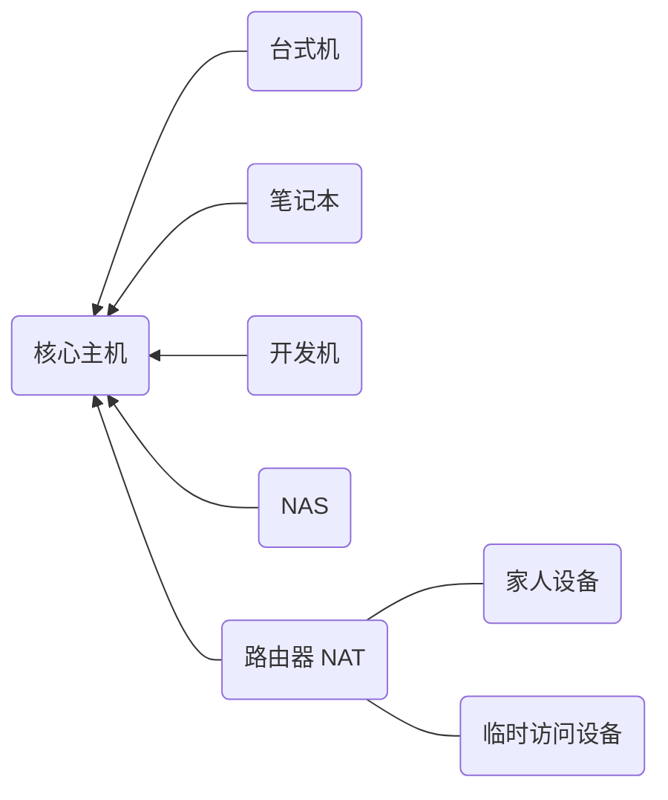
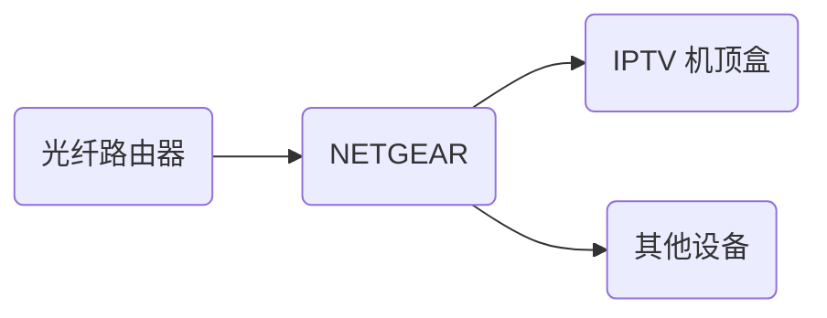

# 组网实例

上面说了很多理论的东西，任何说教都比不上实践。下面结合实例，跟我一起组建属于自己的tinc网络。
这是作者日常使用的tinc网络。详细说明了作者是如何开始设计和搭建一个tinc网络。包括了目前可以看到的大多数网络环境和应用场景，目前已经稳定运行了超过3年。读者可以按照自己的需要，从中截取一部分。

## 网络规划

加入VPN的每台主机上，都需要运行tinc，所以您必须有对目标主机的操作权限；

tinc 通过connectTo到主机，出于加密认证的需要，需要有对方主机的描述文件；

tinc 是分布式的，但是维护主机描述文件还是集中起来比较好，所以我设置了一个核心主机，这台主机上保存所有主机的描述文件。其他主机仅需要有本身和这台核心主机的描述文件就可以了。这样可以集中式的管理，降低维护量。增加或者删除主机只需要在这台核心主机上进行就可以了。主机可以在运行期间，自动发现和交换其他主机的描述信息。

我使用的平台比较杂，不用看全部，挑自己用的就好了。

尽量遵循不侵入的方式，尽量少的管理和尽量少自动化的操作。这样降低难度，比较方便一点。

开机就自动连上，每次去点很麻烦，尽量少操作；

普通的使用，用 router 模式即可。

我的网络规划和配置如下，箭头表示 ConnectTo 方向。基本上常见的网络环境都有了，读者可以按照顺序来读，或者直接跳到对应的章节截取需要的网络部分即可。我想，我这个环境覆盖了90%的使用场景，依葫芦画瓢就可以了。

稳定优先，可以接受一定的成本，但要尽可能的降低。

tinc支持多种模式，上述有。使用用交换机模式，可以将多个以太网段连成一个以太网，可以DHCP什么的。但需要转发很多广播包，效率上不如路由器模式。对于我的场景来说，没有这个必要，而且主机少，手工指定所有机器的IP配置并不麻烦，而且这样比较可控，通讯报文和效率都比较高。所以，选择默认的 router 路由模式。

Tinc 有两个大版本。1.0为稳定版，1.1开发版。核心功能1.0版都有了，具体的差别参见官网。本着生产系统稳定优先原则，选择1.0版。

0、最终的网络示意图，基本上常见的网络环境都有了，读者可以按照顺序来读，或者直接跳到对应的章节截取需要的网络部分即可。我想，我这个环境覆盖了90%的使用场景，读者照葫芦画瓢就可以了。

1、建立核心tinc主机

1、安装一台核心tinc主机。这台主机需要具有公网ip，打开tinc使用的端口，外部能直接访问。对于tinc网络中的其他设备而言，只要能上网，能联通这台核心主机的对应端口，就可以联通tinc网络。按个人习惯，IP 定为 10.0.0.254，C类网络（可容纳255台机器），网络掩码为 255.255.255.0，CIDR 10.0.0.254/24。

可以购买云主机VPS 或者具有公网IP的家里的路由器也可以。出于简单稳定的需要，我选择云主机，阿里云。

我的选择，买一台云主机用以运行tinc。不需要太高的配置，个人普通使用1核1GB内存20G普通云盘就可以了。带宽方面按照自己的流量来选择，一般有按使用付费和固定带宽两种模式。我喜欢简单的付费模式，带宽要求也不大，因此选择的是1M固定带宽。这样的配置，目前阿里云的价格是人民币70左右，一次性时间长一点付费还有优惠。我是一次性付了N年，差不多涵盖了有生之年……扔那里慢慢用就好了。

阿里云提供99%以上的可靠性，负载不大，基本不可能出问题，因此不考虑核心主机的备份了。网络出问题忍一下不是什么大事，主机出了问题，只要配置文件备份好了，重新安装也就是半小时的事情。又不是什么大不了的环境，杀鸡不用牛刀。

安装：

sudo apt-get install tinc -y

ubuntu 的配置文件夹为   /etc/tinc

生成配置文件

生成秘钥

配置为默认运行

/etc/tinc/nets.boot

然后重新启动 

sudo reboot

2、配置常用操作机器（win10）

先安装驱动

然后复制就好了。

同样的 配置

本机启动tinc

然后记得hosts里面加上核心机器的描述文件

然后将本机的描述文件复制到 核心机器上

等一下，或者重新启动 service tinc restart

然后 ping ……

搞定了。

3、配置常用开发机（mac）

4、配置常用测试机（LINUX）

5、配置虚拟机（virtualbox等）

6、配置路由器（openwrt）

7、配置阿里云专有网络，仅有内网IP的机器

8、配置安卓手机

9、配置苹果手机

10、常用便携设备（便携路由）

