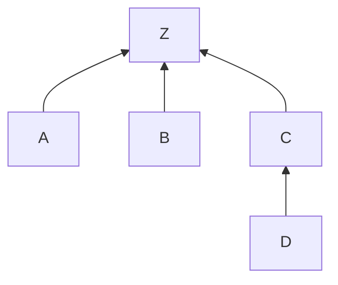

# 分布式网状架构

　　tinc VPN 是对等的 P2P 网络，网络中每个连接的设备都是同等的主机（主机可以是PC、笔记本、路由器、手机平板等一切可以网络连接的设备）。这些主机上都需要运行 tinc，因此需要您对这些主机有操作权限。一台主机可以通过运行多个 tinc 实例的方式加入多个 VPN，每个实例仅占用 2M 左右内存，系统资源占用极小。

　　与传统 VPN 方案比较，tinc 最大的特点是分布式、基于网状结构的网络路由。基于 P2P 的技术，支持内网穿透，可以实现通讯主机之间流量直达，无需经过中心服务器中继转发。

　　假设一个网络环境，如上图。

　　先仅考虑只有三台主机 A、B、Z 的情况。主机 Z 是一台具有公网 IP 的主机，位于互联网上。主机 A 主动连接 Z，建立连接；主机 B 也主动连接 Z，建立连接。则，当 A 与 B 通讯时，A 与 B 之间将尽量建立直接的连接进行通讯，流量不经过 Z。只有当 A、B 之间无法建立连接的时候，才通过 Z 进行中继和转发（由于内网穿透的支持，这种情况相对较少）。

　　扩展一下，加入主机 C，主机 C 也主动连接 Z。建立连接以后即使 A B 没有配置 C 的主机描述文件，在运行中也会自动发现和定位。当 A、C 之间通讯时，尽量直连，若失败才通过其他主机进行中级转发。

　　继续扩展，加入主机 D。主机 D 是一台访问受限的主机，无法与 A、B、Z 相互访问。但 D 可以与 C 通讯。那么 D 通过主动连接 C，就可以加入VPN并正常访问 A、B、Z。当 Z、D 之间进行通讯时间，C 是它们沟通的桥梁。

　　再扩展……
　　再扩展……
　　再扩展……

　　当 tinc VPN 网络运行了一段时间以后，主机之间不断相互发现和交换主机信息，构成复杂的网状结构。两个主机之间的通讯都尽量直接连接，流量仅在两者之间发生。如果实在无法直接连接，则数据会通过其他主机，甚至是多个主机之间进行中继转发。因此，当其中某个主机出现故障时，其影响的范围是最小化的。对于使用者来说，您不需要关心具体数据是如何在主机之间路由和传输，tinc 为您屏蔽了这一切，您所感知的就是“直接通讯”。

