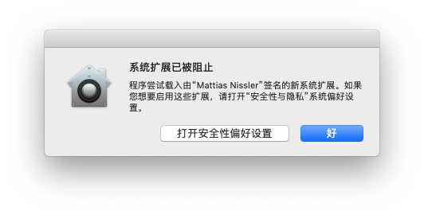
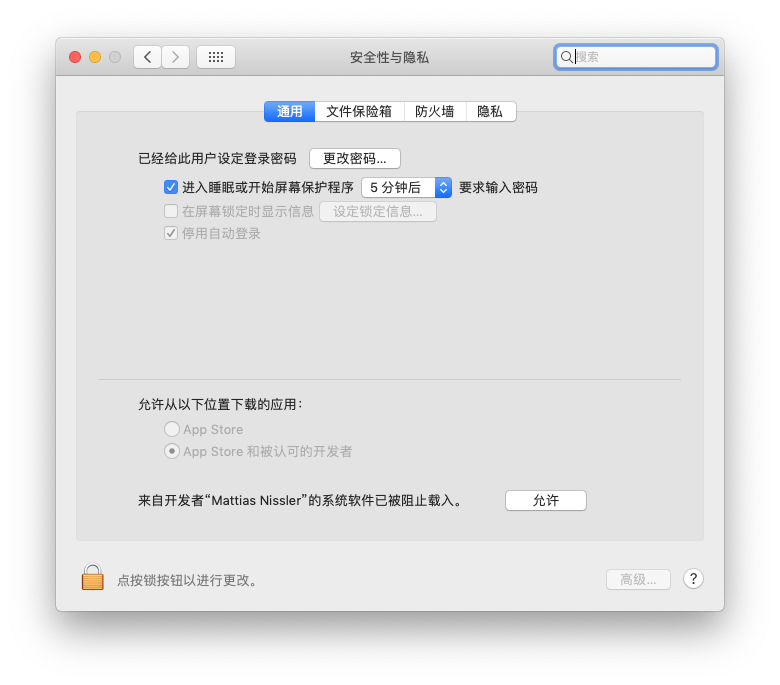

# 4. 开发机 / MacOS Mojave

　　我有一台 Mac mini 作为日常 MacOS 环境的开发机，已经升级为目前最新的版本 Mojave。本节，将这台主机加入到 VPN 中。有点洁癖，所以这次是先删除数据，彻底重新安装后操作并记录的。但是也适用于High Seia 等版本。


详细配置与 VPN 设置：

| 项目         | 数据            |
| --------   | -----   |
| VPN 网络名称 | home_vpn        |
| VPN 主机名称 | macmini        |
| VPN IP       | 10.0.0.102      |
| VPN 子网掩码 | 255.255.255.0   |
| VPN CIDR     | 10.0.0.102/24   |
| tinc 端口    | 655(默认)       |


## 安装 HomeBrew　　
　　官方手册提供的是通过 MacPorts + XCode 安装的方式，不适合普通用户，我推荐使用常用的包管理器 HomeBrew 来安装预编译版，需安装 HomeBrew，如果已经安装则跳过次步。
　　关于 HomeBrew 的介绍和使用，超出了本教程的范围，有需要的读者可以到其官网 https://brew.sh/ 获得更详细的信息，本节只说明操作步骤。


打开终端，执行命令：

```
/usr/bin/ruby -e "$(curl -fsSL https://raw.githubusercontent.com/Homebrew/install/master/install)"
```


## 安装 tinc

　　MacOS 自带 tun/tap 设备，出于兼容性的考虑，使用开源的 tuntap 包作为 tinc 虚拟网卡设备。在终端中执行下列命令：


*出于安全的需要，系统会要求输入鉴定密码或者打开安全设置，请按照提示操作。*

```
brew cask install tuntap
brew install -y tinc
```
　　这里，第一行安装开源 tuntap 包，第二行安装 tinc 软件。

　　注意，由于安全性的需要，安装时如果出现鉴定或者安全性警告，请输入管理员密码通过，或者是打开 系统偏好设置 中的 安全性与隐私，通过操作。如下列图：





## 创建配置文件

1.建立网络配置目录（网络名称为 *home_vpn*）：

通过 HomeBrew 安装的所有包都在 /usr/local 下，tinc的默认主目录为 /usr/local/etc/tinc。刚安装完是没有的。

```
sudo mkdir -p /usr/local/etc/tinc/home_vpn/hosts
```


2.建立配置文件 tinc.conf

```
sudo vi /usr/local/etc/tinc/home_vpn/tinc.conf
```

编辑 tinc.conf 内容如下：

```
Name = macmini
ConnectTo tinc_ali
Device = tap0
```

指明本主机的主机名为 macmini。注意这里通过 Device 指定了设备。


3.建立启动和关闭脚本
创建启动脚本 tinc-up

```
sudo vi /usr/local/etc/tinc/home_vpn/tinc-up
```

编辑 tinc-up 内容如下：

```
#!/bin/sh

ifconfig $INTERFACE 10.0.0.102 netmask 255.255.0.0
```

创建启动脚本 tinc-down

```
sudo vi /usr/local/etc/tinc/home_vpn/tinc-down
```

编辑 tinc-down 内容如下：

```
#!/bin/sh

ifconfig $INTERFACE down
```

赋予脚本可执行权限：

```
sudo chmod +x /etc/tinc/home_vpn/tinc-up
sudo chmod +x /etc/tinc/home_vpn/tinc-down
```


4.创建本主机描述文件（网络名称为 *macmini*）

```
sudo vi /usr/local/etc/tinc/home_vpn/hosts/macmini
```

编辑 tinc_ali 内容如下：

```
Subnet = 10.0.0.102/32
```


## 生成密钥

执行 tincd 生成脚本， -n 指定网络名称，-K 指明生成密钥，可以在 -K 后以数字指定密钥长度，普通用途用默认值（2048）即可。命令执行过程中，需要指定文件名，不用管直接两次回车用默认值即可。

```
sudo tincd -n home_vpn -K
```

运行完成以后，会生成私钥文件 /etc/tinc/home_vpn/rsa_key.priv，并更新本主机的描述文件 /etc/tinc/home_vpn/hosts/macmini。


## 交换密钥

将本主机的 /usr/local/etc/tinc/home_vpn/hosts/macmini 复制到核心主机 /etc/tinc/home_vpn/hosts/macmini。

复制核心主机的 /etc/tinc/home_vpn/hosts/tinc_ali 到本主机 /usr/local/etc/tinc/home_vpn/hosts/tinc_ali。


## 设为自启

　　MacOS 通过 Lauchd 管理系统服务和自启项。需要设置 .plist 文件来设为自启，编辑下列文件：


以root权限向/Library/LaunchDaemons/tincd.home_vpn.plist 写入：


```
<?xml version="1.0" encoding="UTF-8"?>
<!DOCTYPE plist PUBLIC "-//Apple//DTD PLIST 1.0//EN" "http://www.apple.com/DTDs/PropertyList-1.0.dtd">
<plist version="1.0">
<dict>
    <key>KeepAlive</key>
    <true/>
    <key>Label</key>
    <string>tinc.home_vpn</string>
    <key>ProgramArguments</key>
    <array>
        <string>/usr/local/sbin/tincd</string>
        <string>-n</string>
        <string>home_vpn</string>
        <string>-D</string>
        <string>--pidfile=/usr/local/var/run/tinc.home_vpn.pid</string>
    </array>
    <key>StandardErrorPath</key>
    <string>/tmp/tinc.home_vpn.err</string>
    <key>StandardOutPath</key>
    <string>/tmp/tinc.home_vpn.out</string>
</dict>
</plist>
```

启动服务：

```
sudo launchctl load tinc.home_vpn
```

重启系统：

```
sudo reboot
```


## 测试

重启完成后，通过 ping 来验证网络是否互通。

在 desktop 上：

```
ping -c 10.0.0.254
```

在 tinc_ali 上：

```
ping -c 10.0.0.102
```

如果您是严格按照教程做，无意外的话已经能相互 ping 通了。如果ping不通，请检查双方，尤其是 tinc_ali 的防火墙设置是否正确。


## 完成

　　
