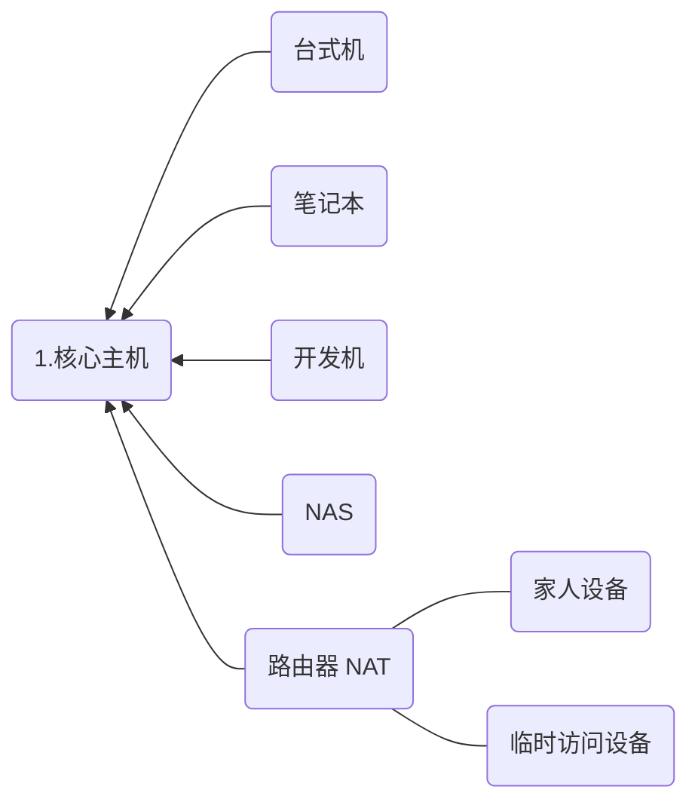

# 组网实例

　　了解了基本知识以后，下面结合实例一起来组建属于自己的 tinc VPN。下面是作者日常使用的tinc网络，包括了目前可以看到的大多数网络环境和应用场景，目前已经稳定运行了超过3年。读者可以按照自己的需要，从中截取需要的部分。

　　所有实例都经过实际操作验证，即使不了解网络，同样的步骤依葫芦画瓢操作一次，也一定能组建起您的专属 tinc VPN。

## 复习、思路和规划

* 加入 VPN 的每台主机都需运行 tinc，需有目标主机的操作权限；
* 主机通过网络配置文件中指定的 ConnectTo，主动连接到指定的主机；
* 出于加密认证的需要，ConnectTo 的双方皆需有对方主机的描述文件；
* 出于稳定原则，tinc 的版本选择其稳定版 1.0.x； 
* 通过互联网建立 VPN（工作在 IP 层面），使用默认路由器（router）模式即可；
* 开机即连通 VPN，无需其他操作，降低使用难度；
* 要能方便的进行主机的增加和删除，降低维护难度；

## 网络示意图

　　网络名称定为 *home_vpn*，下面是示意图，图中的箭头表示 ConnectTo 方向。基本上覆盖了常见的各种网络环境，可以按照顺序来读，或者直接跳到对应的章节截取需要的部分：

**不是分布式吗？为什么要核心主机？**

　　一方面，我们基于互联网建立 VPN，主机必须能直接或间接的进行通讯，这要求整个网络中至少要有一台具有公网 IP 的主机。

　　另一方面，出于简单实用的原则，采用集中式的管理。主机之间的加密和认证是通过读取主机描述文件中的密钥来实现的。tinc 提供自动的主机发现和信息交换，因此只需在核心主机上保存所有的主机描述文件即可。其他主机连接核心主机成功后，能自动发现其他主机，并通过核心主机获得其描述文件。如果分布式管理，将主机描述文件散落在每一台主机上，更新和维护相对是件比较麻烦的事情。

**核心主机选用什么方案？**

　　核心主机最关键的两个条件是，具有公网 IP，可以运行 tinc。因此云主机（VPS） 或有公网 IP 的设备（家里的电脑、路由器等）都可以选择。

　　**出于简单和稳定原则，我建议购买云主机。**云主机无需担心断网断电，而且一般都具 90% 以上的可靠性。我购置了一台*阿里云*主机专门用来运行 tinc。

　　个人用途的 VPN 规模不会很大，因此无需太高配置，1核1GB内存20G普通云盘足矣。带宽流量方面，阿里云有按使用付费和固定带宽两种模式收费方式。个人喜欢简单的付费模式，选择 1M 固定带宽。这样的配置，目前价格在人民币 70 左右（长期续费有优惠）。未来如果有需要扩容也非常方便。于是，一次性付了10年+，差不多涵盖了有生之年……

