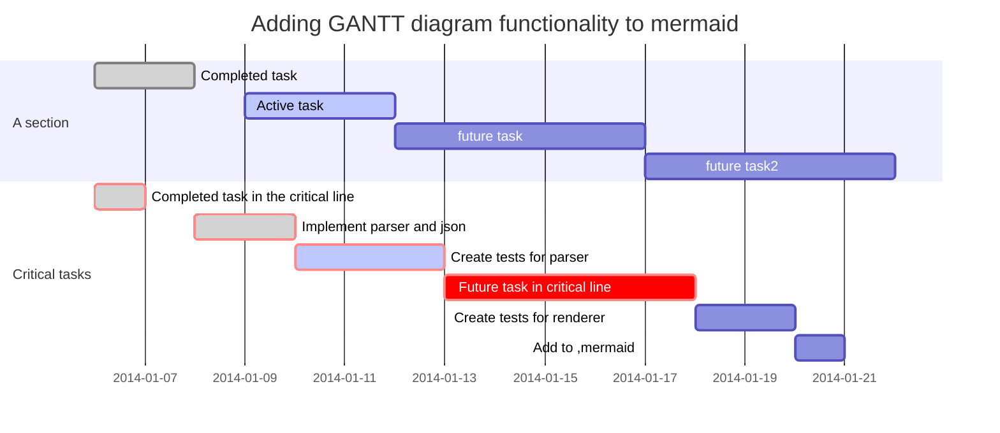

# tinc 简介

tinc 是一个组建虚拟专用网络（VPN）的小工具，可以将不同环境的设备组成一个虚拟网络，增减设备也很方便。无论在什么地方，只要能连入互联网，就可以直接访问 VPN 里的设备，进行移动办公、运维什么的非常方便，再加上通讯经过加密和压缩，安全性也有提高。

软件的官网在这里： 

https://www.tinc-vpn.org/

 ，内容还是蛮齐全的。粗粗的来看，和之前流行的蛤蟆吃、浩方对战平台很类似，都是通过创建虚拟网卡来实现的。

tinc 具体技术细节就不多说了，有兴趣的同学看上面官网吧。对于我来说，选择 tinc 有以下几个理由：

- 开源，截止目前还在不断更新完善；
- 分布式网络结构，避免传统拨号 VPN 中，中心服务器的高负载和的单点故障；
- tinc 运行一个守护进程，所有发到虚拟网卡的报文，由这个守护进程来进行加密压缩等处理并通过真实的网络通讯；
- 对于应用来说不需要额外关注，能感受到的就是系统里多了块网卡(TUN/TAP）；
- 通讯支持加密、压缩，支持参数选择；
- 支持常见的操作系统和网络拓扑，适用场景广泛；

闲话少说，下面开始折腾：

**基础知识：**

**版本和模式**：

Tinc 有两个大版本。1.0为稳定版，1.1开发版。核心功能1.0版都有了，具体的差别参见官网。本着生产系统稳定优先原则，选择1.0版。

tinc支持两种网络模式，switch（交换机）和 router（路由），默认路由。用交换机模式，可以将多个以太网段连成一个以太网，可以DHCP什么的。对于我来说，宁愿手工指定所有机器的IP配置，这样比较可控，通讯报文也比较少。所以，选择默认的 router 路由模式。

配置文件：

tinc 是个对等的网络，没有server和client之分，每个连接的设备都是一个节点。各台机器上的配置文件都差不多。配置文件一般是一个目录，大概的目录结构是酱紫的（括号里面的是注释和说明）：

1. ├── NETNAME_1 （tinc 网络的名称，在启动 tinc 的时候作为标识）
2.    ├── hosts （放置本节点要连接到的各节点的基本配置信息）
3.    │   ├── HOST_1 （节点1的配置文件）
4.    │   ├── HOST_1-up （节点1连接上时会调用执行的脚本，可选）
5.    │   ├── HOST_1-down （节点2断开上时会调用执行的脚本，可选）
6.    │   ├── ...
7.    │   ├── HOST_n （节点n的配置文件）
8.    │   ├── HOST_n-up （节点n连接上时会调用执行的脚本，可选）
9.    │   └── HOST_n-down （节点2断开上时会调用执行的脚本，可选）
10.    ├── rsa_key.priv （由 tincd 生成的本节点使用的非对称私钥，加密通讯使用）
11.    ├── tinc.conf （本 tinc 网络的配置文件）
12.    ├── tinc-down （关闭该网络时，会调用执行的脚本，可选）
13.    └── tinc-up （启动该网络时，会调用执行的脚本，可选）
14. 

复制代码

注：某些系统可能会有点差异，但差不多就这个意思，万变不离其宗，各位自己融会贯通一下。

实际操作：

基本需求：

将目前常用的机器用 tinc 组成一 个VPN，虚拟专用网络命名为 vnet34。VPN 网络地址为 10.10.0.0/255.255.0.0（我贪方便用的B类地址，其实一般来说C类够用了，255个呢）。

网络拓扑：

我整理了一下我需要处理的情况，如下图：

 

A 互联网上的机器，绑定了公网IP，可以直接访问公网。tinc 网络里的其他设备需能直接访问这些设备，需要在每台设备上安装 tinc。

B 互联网上的机器，没有绑定公网IP。tinc 网络里的其他设备需能直接访问这些设备，需要在每台设备上安装 tinc。

C 位于路由器后面的设备，tinc 网络里的设备需能直接访问这些设备，需要在每台设备上安装 tinc。

D 位于路由器后面的设备，tinc 网络里的设备无需直接访问这些设备，设备上不需安装，只需在路由上安装 tinc 即可。

C 和 D 有点象，在实际操作中，可以是混用的。比如，我的工作机器上跑了不少虚拟机需要被直接访问，就在这些机器上都安装了 tinc。而对于有些人来说，他们只需要能访问 tinc 网络就可以了，还特喜欢瞎折腾机器（时不时的重装一下啥的）。我要是在他们的机器设备上安装 tinc 那真是烦透了。这种情况，在路由器上装上，让他们通过路由透明代理到 tinc 网络就可以了。

**Ubuntu 16.04 LTS 下 tinc 的安装与配置：**

首先处理A那块的主机 aliyun_sh1 和 aliyun_bj1，这两台机器都有公网IP，操作系统均为 Ubuntu 16.04 LTS，先折腾  aliyun_sh1。

**1、安装 tinc**

1. sudo apt-get update && sudo apt-get install tinc -y

复制代码

2、建立配置目录

Ubuntu 会从源下载并安装，安装完以后，默认配置目录是 /etc/tinc。接着建立一个目录 vnet34（就是上面需求提到过的 tinc 网络名），在这个目录下存放所有 vnet34 的配置文件，顺便把它下面的 hosts 也建了。

1. sudo mkdir -p /etc/tinc/vnet34/hosts

复制代码

然后参考上文提到的配置文件说明，逐个逐个文件搞……真心吐槽，为毛 Ubuntu 就不能提供一个模版修改一下完事，还要手工折腾？! 用喜欢的编辑器折腾吧（顺带提一句" vi 是最好用的编辑器！没有之一！"），下面我贴上了所有的内容：

tinc.conf:

1. Name = aliyun_sh1
2. AddressFamily = ipv4
3. Cipher = aes-256-cbc
4. Digest = SHA512
5. Interface = tun0
6. 
7. ConnectTo = aliyun_bj1

复制代码

Name 说明本节点的名称；

AddressFamily 选择IP协议，我用的 ipv4，够用了；

Cipher，Digest  是加密的参数；

Interface 指明用到的网卡接口；

ConnectTo 指明当网络系统的时候，自动连接哪些节点（可以通过设定多个 ConnectTo 来连接多个节点）

tinc-up

1. \#!/bin/sh
2. ifconfig $INTERFACE 10.34.34.101 netmask 255.255.0.0

复制代码

tinc-down

1. \#!/bin/sh
2. ifconfig $INTERFACE down

复制代码

记得 tinc-up，tinc-down 什么的是脚本，需要有执行权限，表忘记 “chmod +x”。

**3、生成密钥**

执行命令：

1. sudo tincd -n vnet34 -K 4096

复制代码

-n 后面是网络名称，-K  4096 指定生成密钥，密钥长度为4096，有提示就回车选择默认即可。

完成后会自动生成 /etc/tinc/vnet34/rsa_key.priv 和 /etc/tinc/vnet34/hosts/aliyun_sh1 两个文件。其中 rsa_key.priv 是本节点的加密私钥，aliyun_sh1 是本节点的配置信息（包含了加密公钥）。

接着，编辑一下 /etc/tinc/vnet34/hosts/aliyun_sh1，加入这个节点的一些配置信息，完成后，大概是下面这个样子的：

aliyun_sh1:

1. Address = aaa.aaa.aaa.aaa
2. Subnet = 10.10.0.1/32
3. 
4. -----BEGIN RSA PUBLIC KEY-----
5. ...
6. ...
7. ...
8. -----END RSA PUBLIC KEY-----

复制代码

Address 说明本节点的公网IP，如果没有公网IP，则不用配置这行。可以直接写明IP地址，也可以用域名。

Subnet 指明本节点在 tinc VPN 中的网络地址，本例中将 aliyun_sh1 这个节点的 VPN 地址配置成了 10.10.0.1，后面的掩码 32 说明本节点是单独一个节点。

**4、设置系统启动时自动装载 vnet34**

我希望系统启动的时候自动装载这个VPN，可以通过修改 nets.boot，这个文件指定系统启动后，系统的 tinc 服务自动装载哪些 tinc 网络，一行一个。对于我而言，编辑这个文件，插入一新行 vnet34。：

1. sudo sed -i '$a vnet34' /etc/tinc/nets.boot

复制代码

**5、折腾aliyun_bj1**

OK，到这里 aliyun_sh1 基本配置好了，然后去配置 aliyun_bj1。配置过程和上面一样，参考上面的吧，懒得写了。直接把 aliyun_sh1 的配置目录复制到 aliyun_bj1 对应位置，然后修改一下就好了。aliyun_bj1 的公网地址是 bbb.bbb.bbb.bbb，VPN 地址是 10.10.1.1。记得修改 /etc/tinc/vnet34/tinc.conf 把里面的 ConnectTo 修改成 aliyun_sh1 哦。

**6、交换密钥**

将 /etc/tinc/vnet34/hosts 下的 aliyun_sh1 和 aliyun_bj1 在两台机器之间复制一下。hosts 目录下必须包含 ConnectTo 指定的要连接节点的配置文件。

6、重新启动

1. sudo reboot

复制代码

不方便reboot的，其实用 sudo service tinc restart 也是一样的。

**7、测试**

两台机器启动完成后，相互之间 ping 内网地址，ping 通了，OK，这个只有两台机的VPN搞定了，挺简单方便的。搭建完内网以后，这两台机器相互之间可以通过内网IP直接互访，部分不希望公开的服务也可以设置为只监听内网端口，相对安全。

Windows 10 下 tinc 的安装与配置：

配置完两台服务器以后，接着折腾自己的工作机器。我的主力机器（大奶机）是一台 Windows 10 专业版（64位）的笔记本。Windows 下的 tinc 客户端在官网可以下载到，链接地址在这里： 

http://tinc-vpn.org/download/

 。这个版本通用于 XP/Win7/Win10，其实从我实际使用上来看，这个所谓安装客户端就是个安装复制工具，把安装好的文件直接复制了也能用。

下载下来是个 exe 文件，执行，然后下一步下一步到底，全部用默认参数安装。我的机器上默认安装在 "C:\Program Files (x86)\tinc"。打开 PowerShell 或者命令行，注意要管理员模式。执行该目录下 tap-winXX 目录下的 addtap.bat，给系统增加一块虚拟网卡。

1. cd "C:\Program Files (x86)\tinc"
2. cd tap-win64
3. .\addtap.bat

复制代码

注意，我的系统是64位的，所以是 tap-win64 下的，如果你是32位系统请自行修改为 tap-win32。安装过程中，会弹出窗口提示安全问题，选择信任就可以了。如果直接在命令行提示错误，请检查是不是用了管理员模式。网卡安装好以后，打开控制面板“控制面板\网络和 Internet\网络连接”，应该可以看到多了块网卡，类型是 "TAP-Win32 Adapter V9"。然后右键点击，重命名，改个喜欢的名字，例如“vnet34”。接着右键点击，属性，Internet 协议版本 4（TCP/IPv4）,设置一下你要用的地址，掩码什么的。

到这里，这块网卡初始配置好了，但有个红叉，提示未连接。这个正常，因为 tinc 还没配置好还没启动呢。参考上面配置目录的配置方法，把上面的步骤做一次就可以了。注意，在 tinc.conf 中：Name 我用了 " danaiji"，Interface 的值应该和新增的虚拟网卡一致，ConnectTo 我写了两行，在启动网络时自动就连接到 aliyun_sh1 和 aliyun_bj1。hosts 下应该有上述两台机器的公钥。也别忘了把本节点的配置文件（hosts/danaiji）复制到两台机器的 hosts 目录中。

然后，执行命令，启动 tinc：

1. tincd -n vnet34

复制代码

tinc 会将自身注册为一个 Windows 服务，并启动。回到刚才网络属性那里，图标下面的红叉没了，提示已经连接。服务默认设置为自动启动，以后每次 Win 一开机，就会自动启动 vnet34，连上VPN。可以通过Win的服务管理对服务进行配置。

最后重启一下大奶机，然后测试一下连通性，搞定！现在VPN里面有三台机器了，两台云主机（A环境），一台我的大奶机（C环境）。相互之间都可以互相访问和联通，Bingo！

上面大致说了一下Win10操作过程，最近忙没心思写成小白教程。正好有人整理了一些，非常详细推荐阅读：

Win7 安装和配置 tinc

黑群晖DSM tinc 的安装与配置：

接着配置家里的NAS，把它也加入进来，对应上面网络示意图中的C场景。怕把这个帖子搞的太长，所以另开帖子写了，传送门在这里： 

黑群晖虚拟机安装和配置 tinc

云主机专有网络中未分配公网地址云主机 tinc 的安装与配置：

这个场景对应上面网络示意图中的B场景。现在一般云主机都用专有网络的模式，内网是专有的相互隔离的。在这种情况下，有两种处理方式：

1、内网机器可以访问公网（例如通过SNAT、弹性IP等），那么参照C的方式，ConnectTo 一台公网 tinc 节点就可以了。

2、内网无法访问公网，那么需要在内网中有一台可以访问到公网的机器，在公网机器上安装 tinc，然后这些内网机器 ConnectTo 公网机器的内网地址就可以了。

《未完待续》

| VPN只是一个名词，实现上有不同的方案和协议。一般我们用的比较多的是中心化的方式。就是A连上VPN服务器，B也连上，C也连上。都通过VPN服务器的认证以后，连成一个虚拟专用网络。  但是在这里，认证需要VPN服务器来完成，同时 A B C 之间的通讯，都需要VPN服务器来进行中继。在这种中心化的方式下VPN服务器是网络的中心，无论是机器负载还是带宽负载都比较大，是单点故障的所在。如果VPN服务器停止了服务，那么整个VPN就陷入瘫痪。  tinc 使用的是分布式的VPN方案。每个设备都是节点，通过交换密钥来进行通讯加密。节点启动的首先去连 ConnectTo 指定中的节点，连入VPN。在通讯时，TINC的节点会依据配置的不同和实际情况，自动的进行报文路由和密钥交换。这样，当VPN中某个节点发生故障无法响应时，能绕过这个节点进行通讯，尽量的使VPN处于可用状态。  当然各有利弊，分布式的主要缺点我认为无法确定的指定路由，在管理上也比中心化的困难一些。首先一点就是你很难简单的关闭一个tinc虚拟专用网。 |
| ------------------------------------------------------------ |
|                                                              |
|                                                              |
|                                                              |

　　在使用上，tinc 是非常简单的。这里先大致的说一下步骤，不用深究，脑子里有概念就可以了。后面的实例是STEP BY STEP 的，也会提到具体的做法。

1、安装tap/tun设备。tinc 需要虚拟网卡来工作，在大多数操作系统里，是通过 tap/tun 设备来完成的。所以您需要先配置您的操作系统。幸运的是，目前主流的大多数操作系统都已经提供了。所以基本上不用关心。

2、安装tinc。很多教程上来就是下载源代码，编译。我去，我觉得完全不需要。我们只是用系统。很幸运，大部分平台都有现成的版本可以拿来主义。如果您的平台不支持，或者您是高手，想自己定制，那么请移步官方，这里，参考官方手册中的相关内容。

3、配置 tinc。tinc 需要进行配置，tinc按照配置来运行。实际上，并不是一个配置文件，而是一套文件，以一定的规范存放在目录里。所以，要学会配置。配置文件都是纯文本的，可以用纯文本编辑器来进行编辑。Notepad, vi 都可以，您可以使用您喜欢的任何编辑器。

4、生成秘钥，并传递给需要的主机。tinc 网络中的数据通过RSA加密算法进行加密传输。所以要生成秘钥，私钥保密，公钥共享。生成完秘钥以后，需要将相关的主机配置文件复制到对方的配置文件中。不用全部节点，connectTo的节点就可以了。在网络运行期间，tinc会自动进行主机秘钥的发现和连接。

4、运行tinc。可以作为用户进程，也可以作为系统服务。个人推荐系统服务。我们假设您拥有主机的完全权限。换句话说，Unix Like 系统你能sudo，windows 你是系统管理员。

如果您不是，那么只能使用用户进程模式，运行了，网通，不运行了，网断。而且您不能使用1024以下的端口。如果涉及到防火墙，那么有可能嗨需要进行防火墙的设置。

5、验证网络是否通畅。可以用最简单的 ping 命令来进行网络的验证。注意，某些系统的防火墙默认是关闭 ping 的。

就是这么简单，只要5步，而且这5步中，需要关心的其实只有 2 3 4，3步而已。非常简单，有信心么？

st=>start: Start
e=>end: End
op1=>operation: My Operation
sub1=>subroutine: My Subroutine
cond=>condition: Yes or No?
io=>inputoutput: catch something...

**[terminal]
**[prompt foo@joe]**[path ~]**[delimiter  $ ]**[command ./myscript]
Normal output line. Nothing special here...
But...
You can add some colors. What about a warning message?
**[warning [WARNING] The color depends on the theme. Could look normal too]
What about an error message?
**[error [ERROR] This is not the error you are looking for]